[](https://github.com/vijethph/FlutterApps)
[](https://github.com/vijethph/FlutterApps/issues)
[](https://github.com/vijethph/FlutterApps/graphs/contributors)
[](https://github.com/vijethph/FlutterApps/network)
[](https://github.com/vijethph/FlutterApps/stargazers)
[](https://github.com/vijethph/FlutterApps/blob/master/LICENSE)
[](https://flutter.dev)
[](https://forthebadge.com)

<br />
<div align="center">
  <a href="https://github.com/vijethph/FlutterApps">
    
  </a>

  <h2 align="center">FlutterApps</h2>

  <p align="center">
    A collection of apps made with Flutter.
    <br />
    <br />
    <a href="https://github.com/vijethph/FlutterApps/issues">Report Bug</a>
    ·
    <a href="https://github.com/vijethph/FlutterApps/issues">Request Feature</a>
  </p>
</div>

<!-- TABLE OF CONTENTS -->

## Table of Contents

- [Table of Contents](#table-of-contents)
- [About The Project](#about-the-project)
- [Getting Started](#getting-started)
  - [Prerequisites](#prerequisites)
  - [Installation](#installation)
- [Contributing ](#contributing-)
- [License](#license)
- [Contact](#contact)
- [Thank You!](#thank-you)
- [Acknowledgements](#acknowledgements)

<!-- ABOUT THE PROJECT -->

## About The Project

|                            im_not_that_rich                            |                              mi_carded                              |                             dicee_state                             |                               quizzlerd                               |
| :--------------------------------------------------------------------: | :-----------------------------------------------------------------: | :-----------------------------------------------------------------: | :-------------------------------------------------------------------: |
| 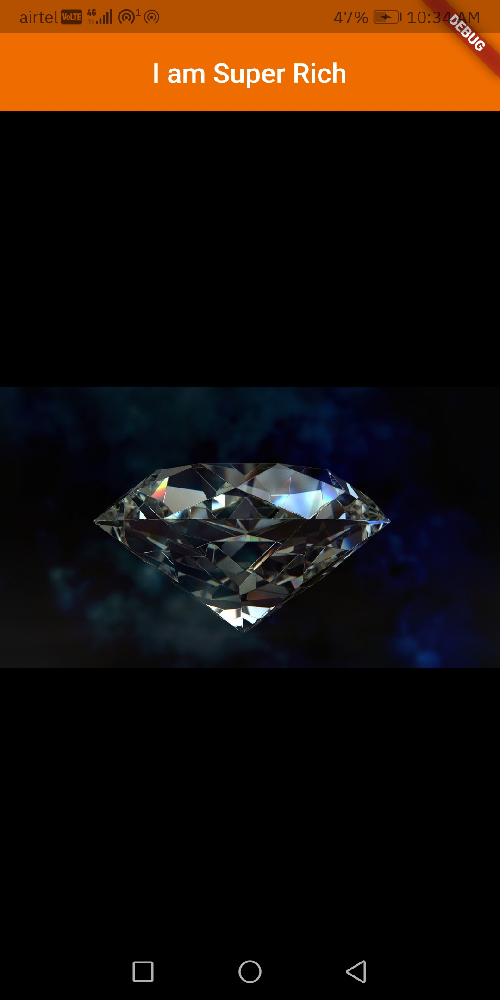 | 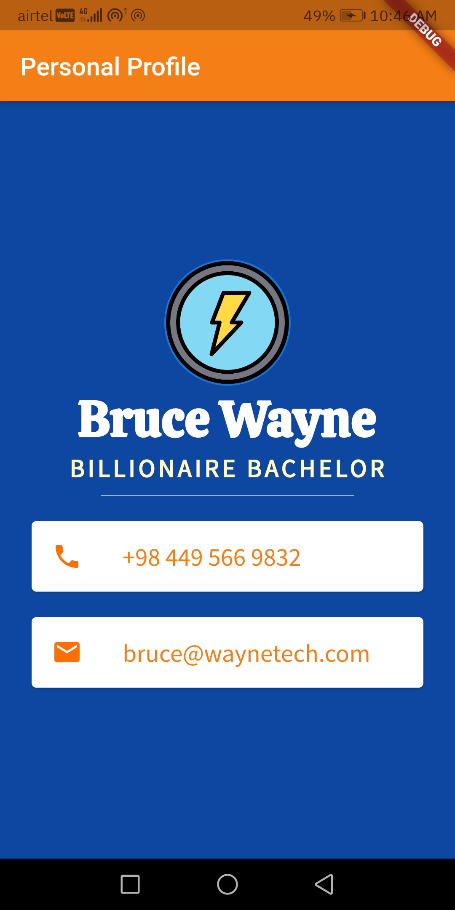 | 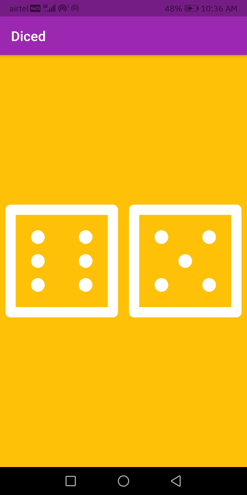 | 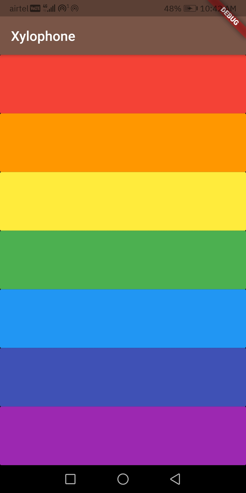 |

|                                                                                                         bmicalc                                                                                                          |                                                                                                clima_weather                                                                                                 |
| :----------------------------------------------------------------------------------------------------------------------------------------------------------------------------------------------------------------------: | :----------------------------------------------------------------------------------------------------------------------------------------------------------------------------------------------------------: |
| <p float="left" align="middle"> 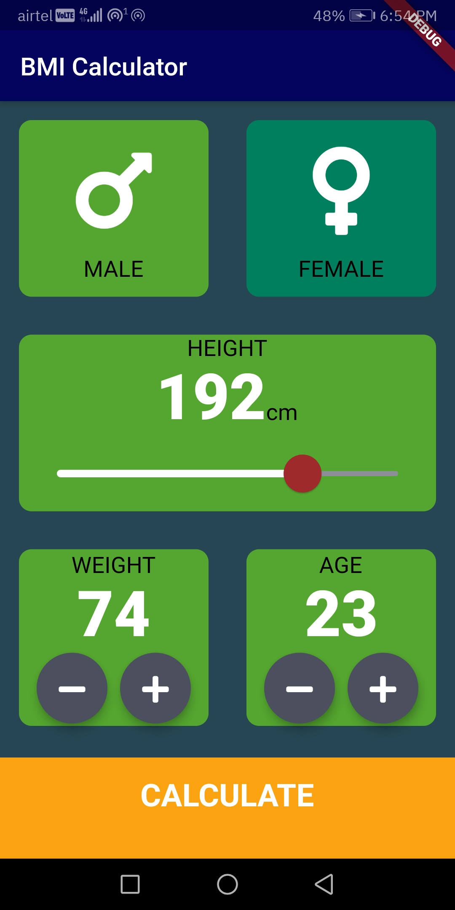 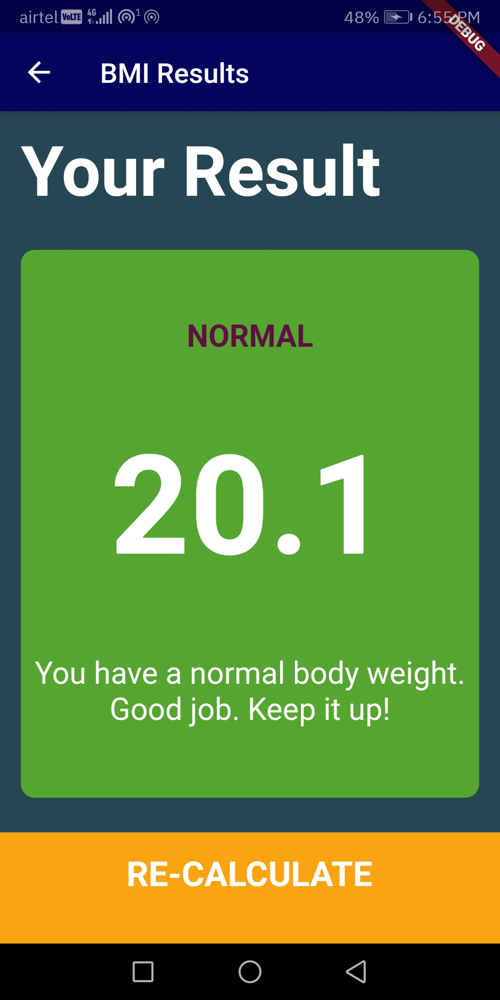 </p> | <p float="left" align="middle"> 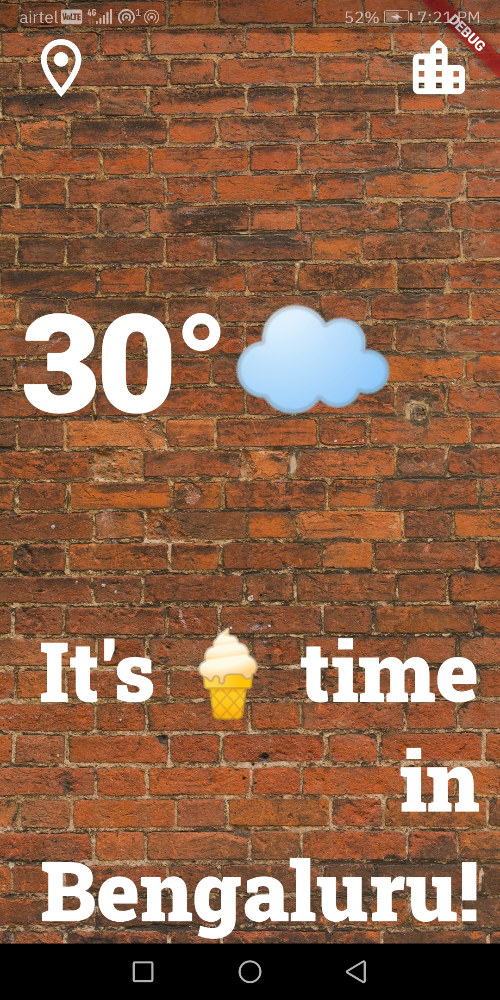 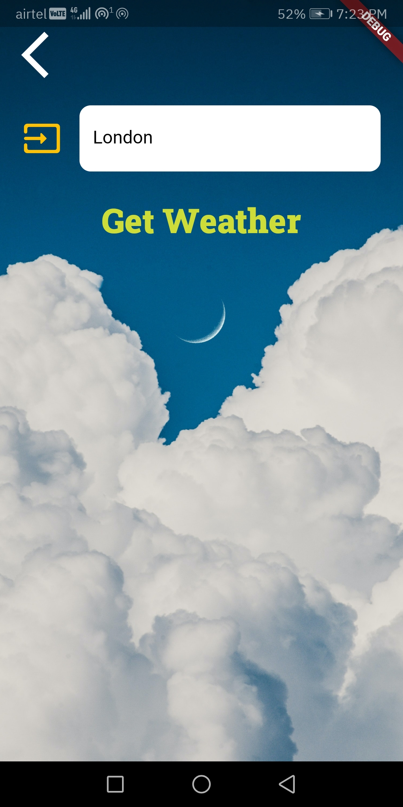 </p> |

|                             notxylophone                             |                                bitcoin_ticker                                 |                              flash_chat                               |                             todo_app                              |
| :------------------------------------------------------------------: | :---------------------------------------------------------------------------: | :-------------------------------------------------------------------: | :---------------------------------------------------------------: |
| 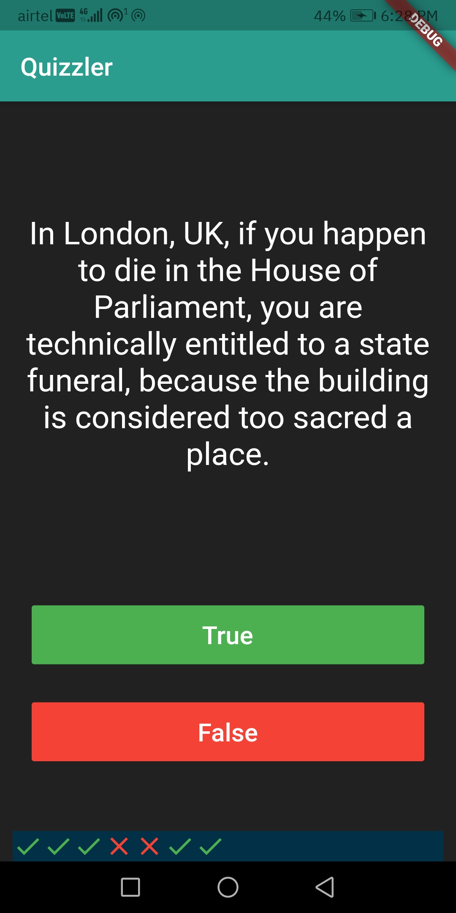 | 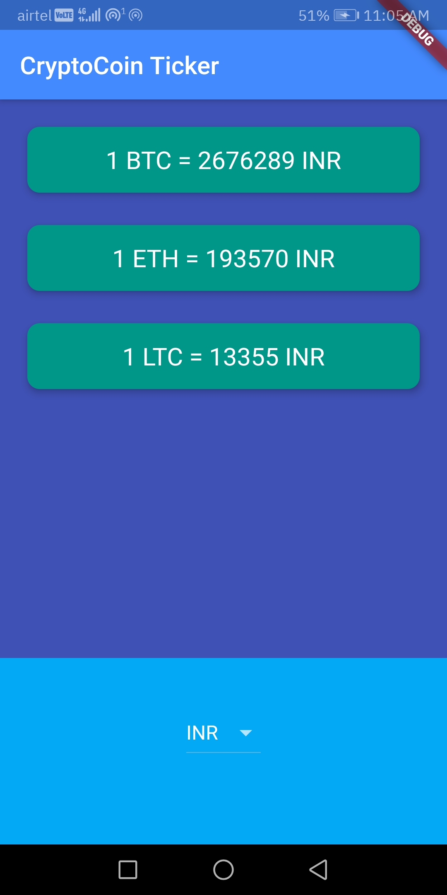 | 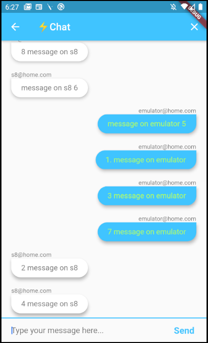 | 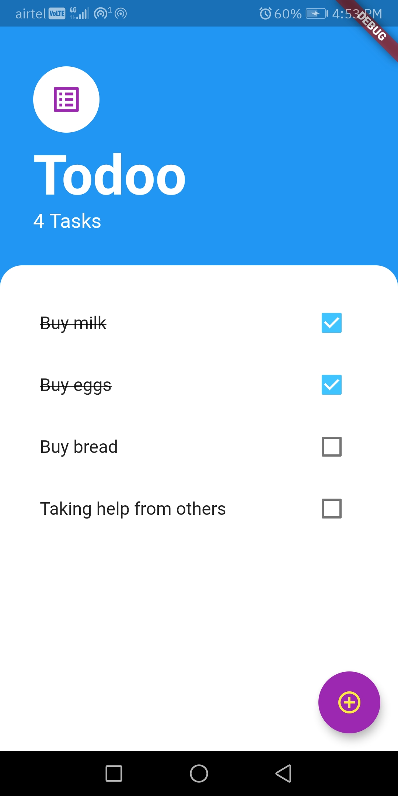 |

These are some collection of Flutter apps built by following some tutorials.

<!-- GETTING STARTED -->

## Getting Started

Follow these instructions in order to get a copy of the project up and running on your local machine for development and testing purposes.

### Prerequisites

Java Runtime Environment(JRE)>=8, Android SDK API level 28 or higher should be installed. Flutter and Dart SDKs should be installed. After installation, check Java version, and Flutter configuration using

```sh
java --version
flutter doctor
```

### Installation

1. Download or Clone the repo

```git
git clone https://github.com/vijethph/FlutterApps.git
```

2. Open the downloaded repository folder, and open any project

```sh
cd FlutterApps
cd 'project-name'
```

3. Make sure Flutter executable is added to environment variables. Go to project root and execute the following command in console to get the required dependencies

```sh
flutter pub get
```

4. Connect your Android device to your desktop. Make sure it is properly connected by using

```sh
flutter devices
```

5. Install and run the app using

```sh
flutter run
```

<!-- CONTRIBUTING -->

## Contributing [](https://github.com/vijethph/FlutterApps/pulls)

Contributions are what make the open source community such an amazing place to be learn, inspire, and create. Any contributions you make are **greatly appreciated**.

1. Fork the Project
2. Create your Feature Branch (`git checkout -b feature/AmazingFeature`)
3. Commit your Changes (`git commit -m 'Add some AmazingFeature'`)
4. Push to the Branch (`git push origin feature/AmazingFeature`)
5. Open a Pull Request

<!-- LICENSE -->

## License

Distributed under the MIT License. See `LICENSE` for more information.

<!-- CONTACT -->

## Contact

Vijeth P H - [@vijethph](https://github.com/vijethph)

Project Link: [https://github.com/vijethph/FlutterApps](https://github.com/vijethph/FlutterApps)

## Thank You!

[](https://forthebadge.com)

If you like this project, please ⭐ this repo and share it with others 👍

<!-- ACKNOWLEDGEMENTS -->

## Acknowledgements

- [Flutter Docs](https://flutter.dev/docs)
- [Firebase ML Docs](https://firebase.google.com/docs)
- [London App Brewery](https://www.londonappbrewery.com/)
